# LED Panel

## Table of Contents

- [LED Panel](#led-panel)
  - [Table of Contents](#table-of-contents)
  - [Overview](#overview)
  - [Demo](#demo)
  - [Features](#features)
    - [Highlighted Capabilities](#highlighted-capabilities)
      - [Message Editor](#message-editor)
      - [Persistence](#persistence)
  - [Requirements](#requirements)
  - [Installation](#installation)
    - [1. Clone the repository](#1-clone-the-repository)
    - [2. Install dependencies](#2-install-dependencies)
    - [3. Run the app](#3-run-the-app)
  - [Project Structure](#project-structure)
  - [Architecture](#architecture)

## Overview


LED Panel is a Flutter mobile application that enables users to design and preview scrolling LED-style text messages. It is aimed at casual users and hobbyists who want to create animated LED displays for events, personal signage, or demo purposes.

<p align="center">
  <a href="https://aleax888.itch.io/led-panel" align="center">
      
      <br>
      <strong>Abailable on itch.io</strong>
  </a>
</p>


## Demo

<table align="center" style="border: none; border-collapse: collapse;">
  <tr style="border: none;">
    <td align="center" style="border: none;">
      <strong>Home</strong><br><br>
      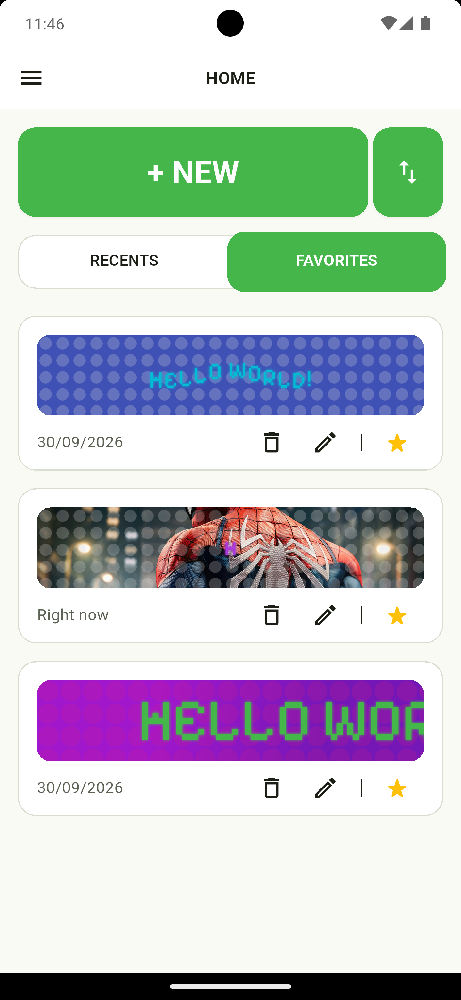
    </td>
    <td align="center" style="border: none;">
      <strong>Theme</strong><br><br>
      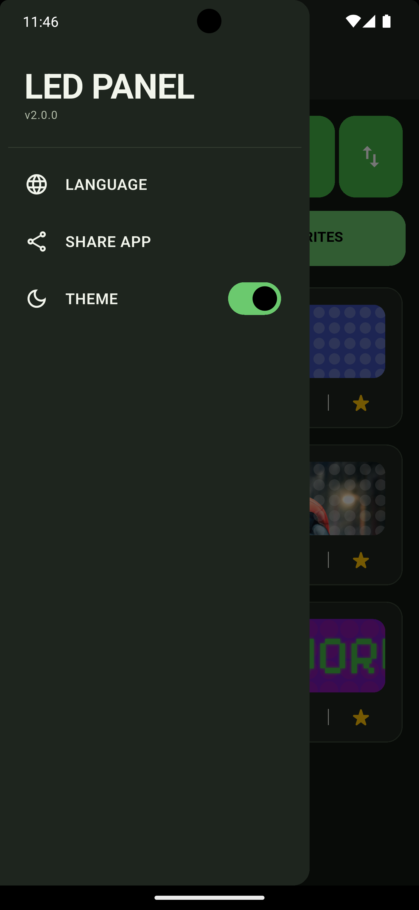
    </td>
    <td align="center" style="border: none;">
      <strong>Text config</strong><br><br>
      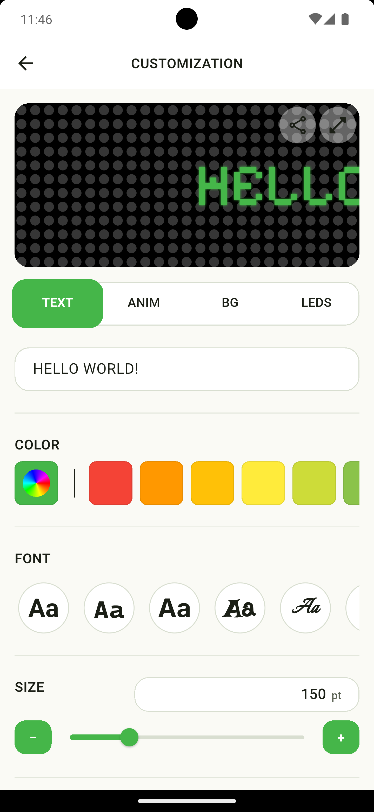
    </td>;
  </tr>
</table>

<table align="center" style="border: none; border-collapse: collapse;">
  <tr style="border: none;">
    <td align="center" style="border: none;">
      <strong>Animation config</strong><br><br>
      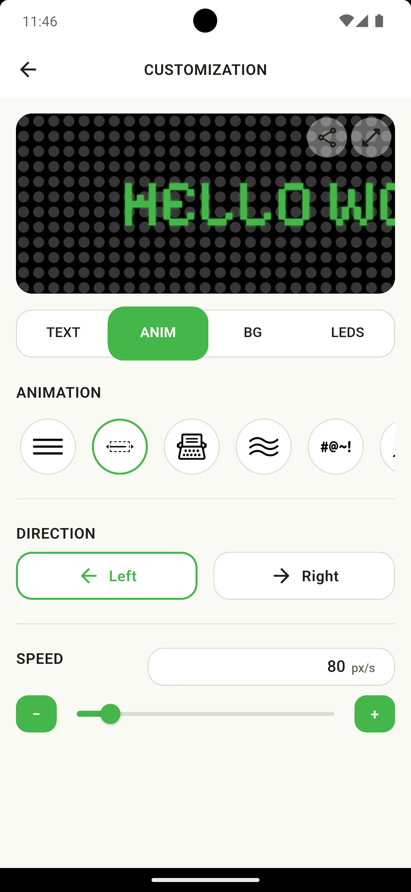
    </td>
    <td align="center" style="border: none;">
      <strong>BG config</strong><br><br>
      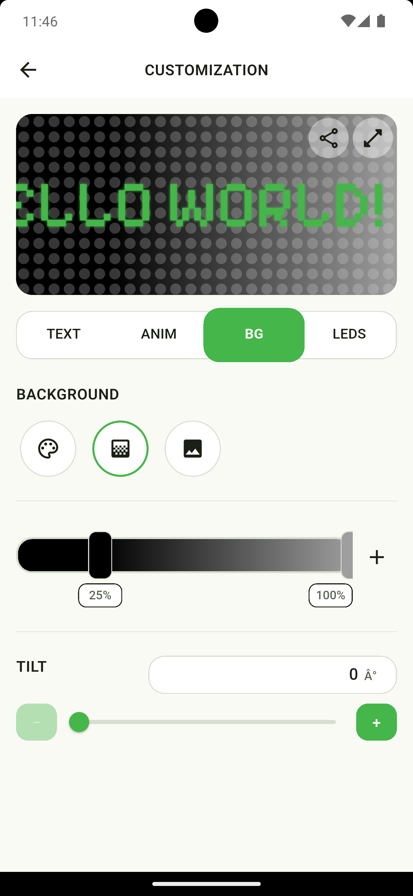
    </td>
    <td align="center" style="border: none;">
      <strong>LEDs config</strong><br><br>
      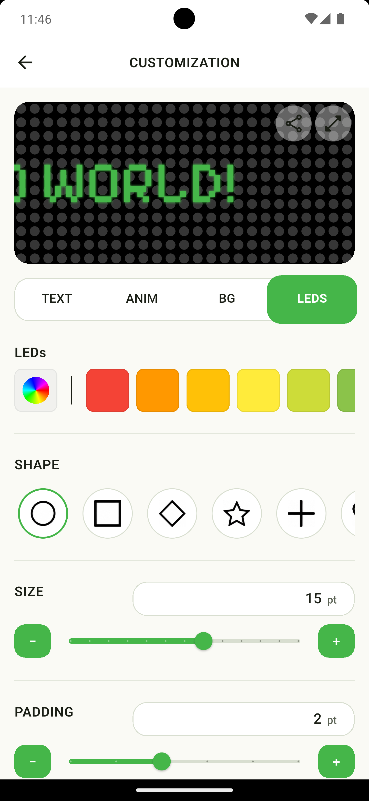
    </td>
  </tr>
</table>

<table align="center" style="border: none; border-collapse: collapse;">
  <tr>
    <td align="center" style="border: none;">
      <strong>Animated Preview</strong><br><br>
      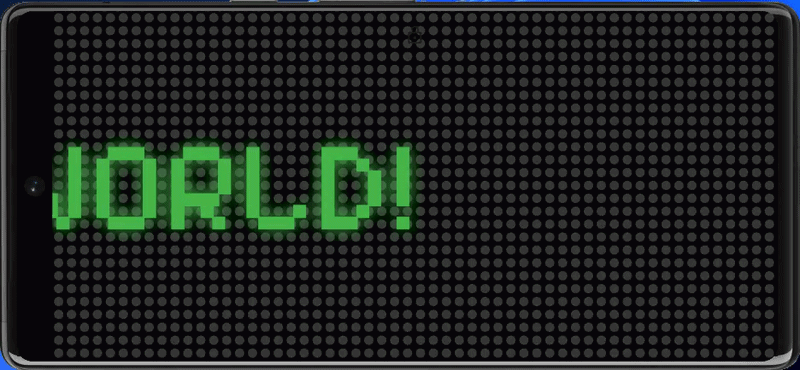
    </td>
  </tr>
  <tr>
    <td align="center" style="border: none;">
      <strong>Animated Preview</strong><br><br>
      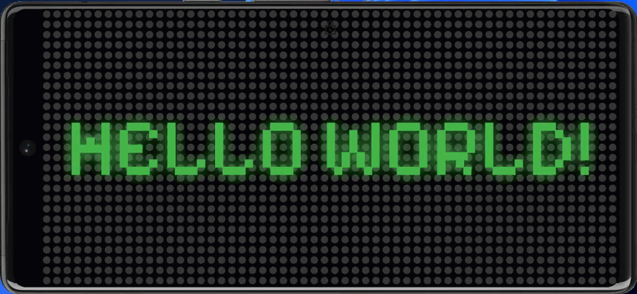
    </td>
  </tr>
  <tr>
    <td align="center" style="border: none;">
      <strong>Animated Preview</strong><br><br>
      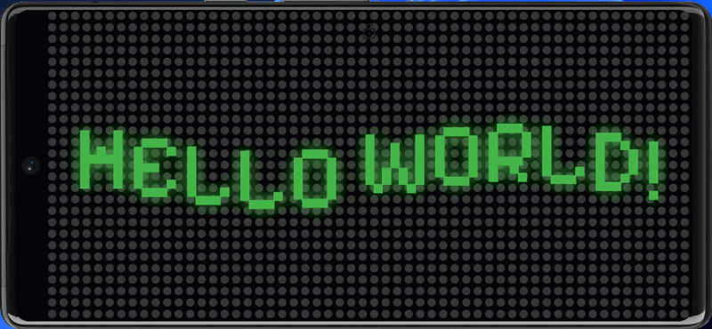
    </td>
  </tr>
  <tr>
    <td align="center" style="border: none;">
      <strong>Animated Preview</strong><br><br>
      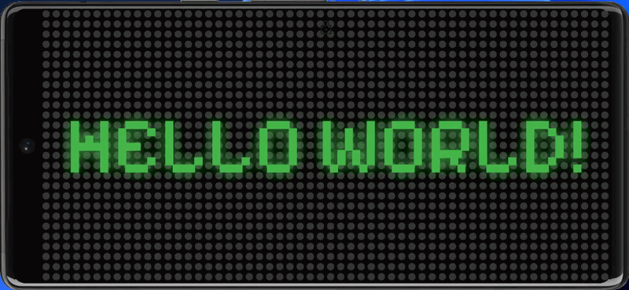
    </td>
  </tr>
  <tr>
    <td align="center" style="border: none;">
      <strong>Animated Preview</strong><br><br>
      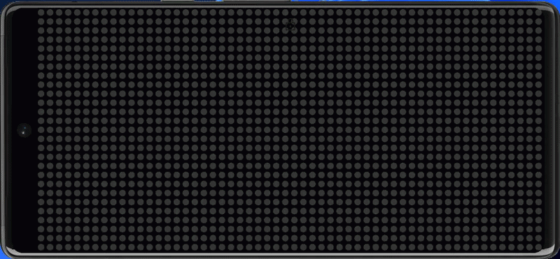
    </td>
  </tr>
</table>


## Features

- Choose from six animation types: none, marquee, typewriter, wave, scramble, and crawl, each with its own settings.
- Customize text, background, and LED colors.
- Select font family and size, and adjust letter and word spacing.
- Fine-tune glow, brightness, animation speed, and direction.
- Switch between light and dark themes.
- Save, delete, and favorite configurations.
- Import and share configurations.
- Choose from six languages: Spanish, English, Italian, German, Portuguese, and French.
- Display messages in immersive fullscreen landscape mode.

### Highlighted Capabilities

#### Message Editor

Real-time preview while editing text, styles, and animation.

#### Persistence

Local storage of configurations using `shared_preferences`.

## Requirements

- Flutter SDK (stable) 
- Dart SDK (bundled with Flutter)

Check your installed versions:

```bash
flutter --version
```

## Installation

### 1. Clone the repository

```bash
git clone [REPOSITORY_URL]
cd led_panel
```

### 2. Install dependencies

```bash
flutter pub get
```

### 3. Run the app

```bash
flutter run
```

## Project Structure

```text
.
├── assets/
├── lib/
│   ├── bloc/
│   │   ├── configs/
│   │   │   ├── animations/
│   │   │   ├── backgrounds/
│   │   │   ├── leds/
│   │   │   └── text/
│   │   ├── led_panel/
│   │   ├── led_panel_list/
│   │   ├── locale/
│   │   └── theme/
│   ├── data/
│   │   ├── enums
│   │   ├── models
│   │   └── repositories
│   │       ├── led_panel_list/
│   │       ├── locale/
│   │       └── theme/
│   ├── l10n/
│   ├── presentation/
│   │   ├── pages/
│   │   └── widgets/
│   ├── theme/
│   │   ├── constants/
│   │   ├── styles/
│   │   └── themes/
│   ├── utils/
│   │   └── extensions/
│   └── main.dart
```

## Architecture

The app uses a small, modular architecture centered on BLoC for state management and a repository interface for persistence.

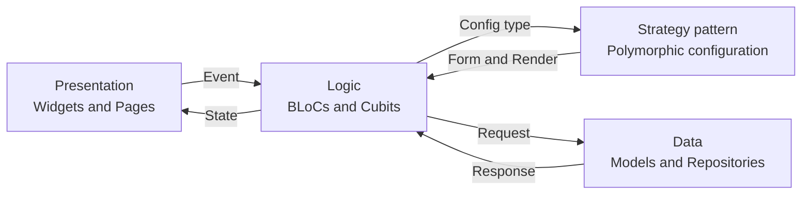