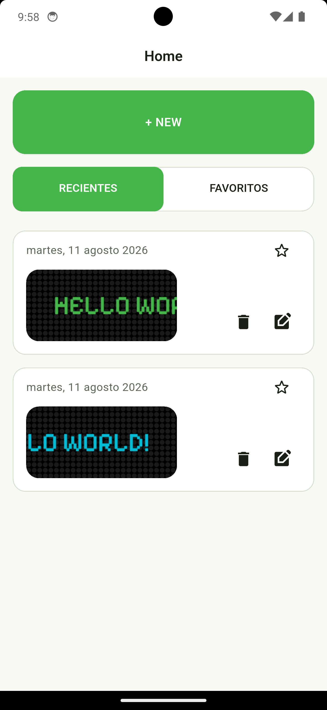
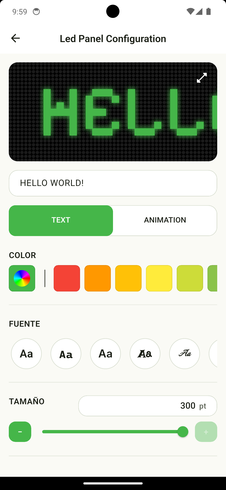
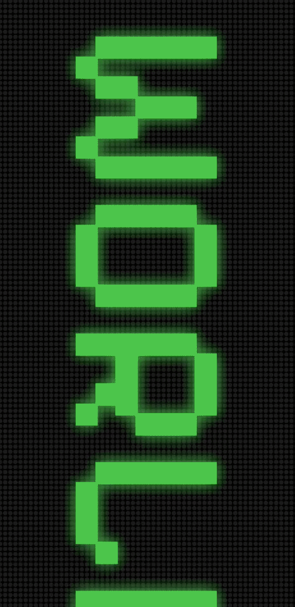
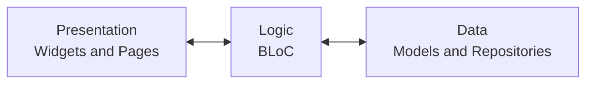

# LED Panel

## Table of Contents

- [LED Panel](#led-panel)
  - [Table of Contents](#table-of-contents)
  - [Overview](#overview)
  - [Demo](#demo)
  - [Features](#features)
    - [Highlighted Capabilities](#highlighted-capabilities)
      - [Message Editor](#message-editor)
      - [Persistence](#persistence)
  - [Requirements](#requirements)
  - [Installation](#installation)
    - [1. Clone the repository](#1-clone-the-repository)
    - [2. Install dependencies](#2-install-dependencies)
    - [3. Run the app](#3-run-the-app)
  - [Project Structure](#project-structure)
  - [Architecture](#architecture)

## Overview


LED Panel is a Flutter mobile application that enables users to design and preview scrolling LED-style text messages. It is aimed at casual users and hobbyists who want to create animated LED displays for events, personal signage, or demo purposes.

<a href="https://aleax888.itch.io/led-panel">
  <div align="center">
    
    <br>
    <strong>Abailable on itch.io</strong>
  </div>
</a>


## Demo

<table align="center" style="border: none; border-collapse: collapse;">
  <tr style="border: none;">
    <td align="center" style="border: none;">
      <strong>Home</strong><br><br>
      
    </td>
    <td align="center" style="border: none;">
      <strong>Configuration</strong><br><br>
      
    </td>
    <td align="center" style="border: none;">
      <strong>Animated Preview</strong><br><br>
      
    </td>
  </tr>
</table>


## Features

- Create and edit LED-style messages with custom text.
- Adjust text color, background color, and LED color.
- Select font family and size, letter and word spacing.
- Control glow/brightness and scrolling speed/direction.
- Save, delete, and mark configurations as favorites.
- Fullscreen immersive display mode (landscape).

### Highlighted Capabilities

#### Message Editor

Real-time preview while editing text, styles, and animation.

#### Persistence

Local storage of configurations using `shared_preferences`.

## Requirements

- Flutter SDK (stable) 
- Dart SDK (bundled with Flutter)

Check your installed versions:

```bash
flutter --version
```

## Installation

### 1. Clone the repository

```bash
git clone [REPOSITORY_URL]
cd led_panel
```

### 2. Install dependencies

```bash
flutter pub get
```

### 3. Run the app

```bash
flutter run
```

## Project Structure

```text
.
├── lib/
│   ├── main.dart
│   ├── bloc/
│   │   ├── led_panel/
│   │   └── led_panel_list/
│   ├── data/
│   │   ├── led_panel_config_model.dart
│   │   ├── led_panel_list_repository.dart
│   │   └── shared_preferences_led_panel_list_repository.dart
│   ├── presentation/
│   │   ├── pages/
│   │   └── widgets/
│   ├── theme/
│   └── utils/
├── assets/
├── android/
├── ios/
├── test/
└── README.md
```

## Architecture

The app uses a small, modular architecture centered on BLoC for state management and a repository interface for persistence.

